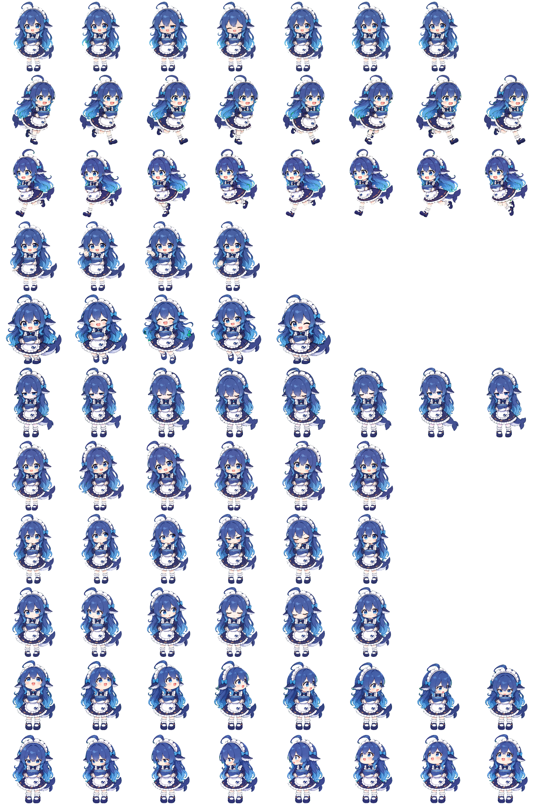

# DeepSeek 鲸鱼娘 · Codex Pet

蓝发女仆鲸鱼娘，爱吃饭、会摆尾，也会认真陪你工作。

这是现有本地 Codex 自定义宠物资源的独立备份仓库。形象为非官方同人宠物。

## 预览

<details>
<summary>查看完整动画精灵图</summary>



</details>

## 安装

需要支持 v2 自定义宠物的 Codex 桌面应用。以下命令适用于 macOS / Linux；私有仓库需要先登录有权限的 GitHub 账号。

```bash
git clone https://github.com/Dremig/codex-deepseek-whale-chan.git
cd codex-deepseek-whale-chan
pet_dir="${CODEX_HOME:-$HOME/.codex}/pets/deepseek-whale-chan"
mkdir -p "$pet_dir"
cp -i pet.json spritesheet.webp "$pet_dir/"
```

若目标位置已存在同名文件，`cp -i` 会先询问是否覆盖。重新打开 Codex 后，在宠物选择界面选择 **DeepSeek 鲸鱼娘**。

## 资源格式

| 文件 | 用途 |
| --- | --- |
| `pet.json` | 宠物 ID、名称、描述和 v2 精灵图配置 |
| `spritesheet.webp` | 1536 × 2288 透明动画精灵图 |

精灵图为 8 列 × 11 行，单帧 192 × 208。前 9 行对应标准动画状态，最后 2 行包含 16 个朝向。配置中的 `spriteVersionNumber` 为 `2`。

资源保持本地已安装版本的原始内容；本次归档核对了配置字段、图像尺寸及复制前后的文件一致性，未重新生成动画或重新执行完整动画语义 QA。
