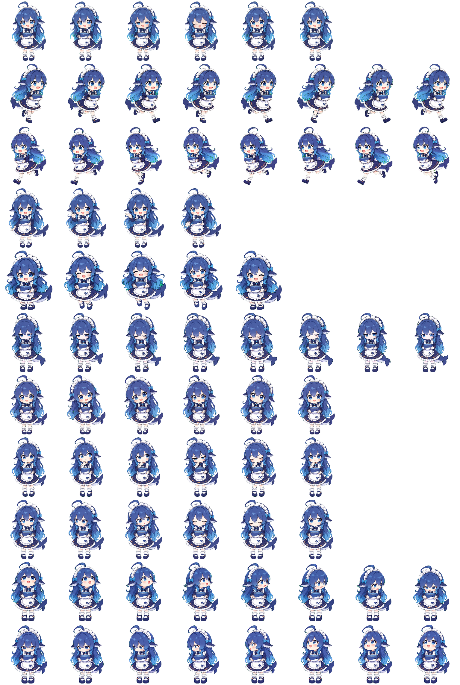
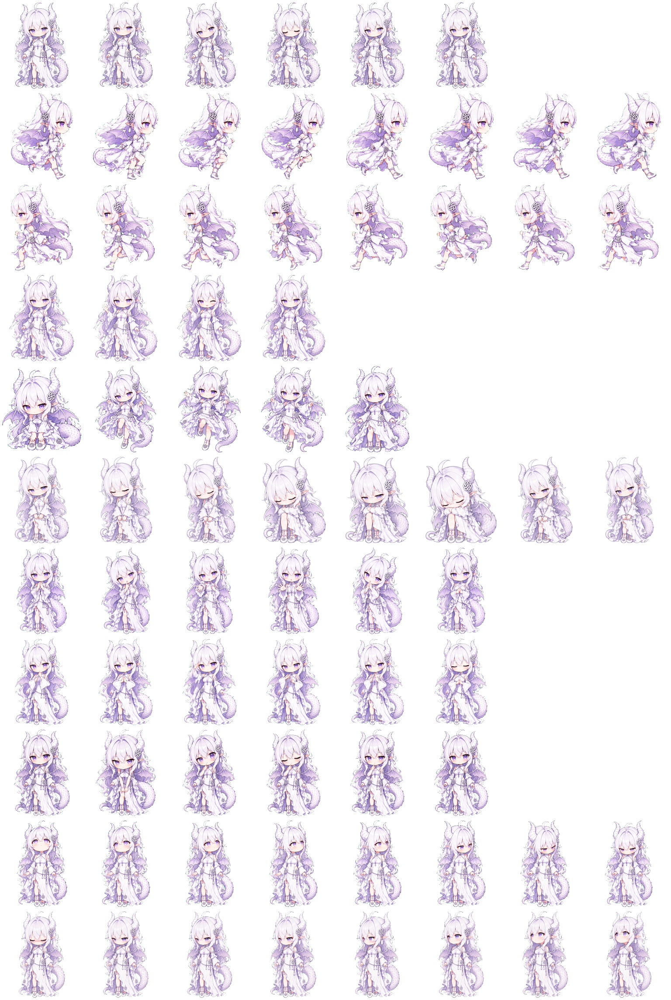

# Codex Custom Pets

This repository contains two unofficial custom pets for Codex. Each pet is packaged separately under `pets/<pet-id>/` and can be installed independently.

| Pet | ID | Description |
| --- | --- | --- |
| DeepSeek Whale-chan (DeepSeek 鲸鱼娘) | `deepseek-whale-chan` | A blue-haired, whale-inspired maid character. This is an unofficial fan creation. |
| Xuelong (雪珑) | `xuelong-dragon` | An original dragon character with white hair, violet eyes, twin horns, wings, and a coiled, scaled tail. Contributed by [@xihucuyudaichi](https://github.com/xihucuyudaichi). |

<details>
<summary>Preview the DeepSeek Whale-chan spritesheet</summary>



</details>

<details>
<summary>Preview the Xuelong spritesheet</summary>



</details>

## Installation

Use a Codex desktop version that supports v2 custom pets. Clone the repository first. If it is private, authenticate with a GitHub account that has access.

```bash
git clone https://github.com/Dremig/codex-deepseek-whale-chan.git
cd codex-deepseek-whale-chan
```

On macOS or Linux, select a pet ID and copy its two files:

```bash
pet_id=deepseek-whale-chan # or xuelong-dragon
pet_dir="${CODEX_HOME:-$HOME/.codex}/pets/$pet_id"
mkdir -p "$pet_dir"
cp -i "pets/$pet_id/pet.json" "pets/$pet_id/spritesheet.webp" "$pet_dir/"
```

On Windows PowerShell:

```powershell
$petId = 'deepseek-whale-chan' # or 'xuelong-dragon'
$codexHome = if ($env:CODEX_HOME) { $env:CODEX_HOME } else { Join-Path $HOME '.codex' }
$petDir = Join-Path (Join-Path $codexHome 'pets') $petId
New-Item -ItemType Directory -Path $petDir -Force | Out-Null
Copy-Item -LiteralPath "pets/$petId/pet.json", "pets/$petId/spritesheet.webp" -Destination $petDir -Confirm
```

Repeat the copy step with the other ID to install both pets. Restart Codex or refresh the custom pet list, then select the desired pet.

## Repository structure and asset format

```text
pets/
├── deepseek-whale-chan/
│   ├── pet.json
│   └── spritesheet.webp
└── xuelong-dragon/
    ├── pet.json
    └── spritesheet.webp
```

Each `pet.json` defines an `id` matching its directory, a `displayName`, a `description`, `spriteVersionNumber: 2`, and the relative `spritesheetPath: "spritesheet.webp"`. Each spritesheet is a transparent 1536 × 2288 WebP image arranged as 8 columns by 11 rows, with 192 × 208 pixels per cell. The first 9 rows contain the standard animation states; the final 2 rows contain 16 clockwise look directions. Unused cells must be fully transparent.

To add a pet, use the same directory structure, check the manifest and spritesheet against these requirements, and add an entry to the table above.
